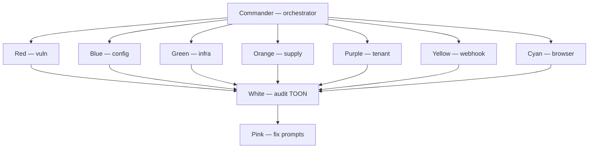

# Agent Skills Registry

Among-Check uses **named agent identities** — each with a codename, skill file, and scanner scope. Skills live in [skills/](../skills/) and are mirrored to [.cursor/skills/](../.cursor/skills/) for Cursor.

**Tagline:** Find imposters among codebase.

---

## Swarm model

| Agent | Hunts imposters like… |
|-------|------------------------|
| **Red** | Routes that look safe but accept injection |
| **Blue** | Headers/cookies that claim protection but don't |
| **Green** | Cloud configs that look locked down but are wide open |
| **Orange** | Clean repos hiding keys in history or CI |
| **Purple** | "My data only" APIs that leak across tenants |
| **Yellow** | Webhooks that pretend to verify signatures |
| **Cyan** | Sessions stored where any XSS can read them |

---

## Skill locations

| Path | Purpose |
|------|---------|
| `skills/<agent>/SKILL.md` | Canonical agent identity + instructions |
| `skills/registry.toon` | Machine-readable roster |
| `.cursor/skills/<agent>/SKILL.md` | Cursor discovery mirror |

---

## When to invoke which agent

| Task | Invoke |
|------|--------|
| Scaffold orchestrator / registry | `orchestrator` |
| SQLi, XSS, IDOR, CSRF scanners | `agent-vuln` |
| Headers, TLS, cookies, GDPR signals | `agent-config` |
| Supabase RLS, Firebase, Vercel, etc. | `agent-infra` |
| Secrets in git, GitHub Actions | `agent-supply` |
| Tenant isolation checks | `agent-tenant` |
| Webhook signature verification | `agent-webhook` |
| localStorage / sessionStorage audit | `agent-browser` |
| TOON archive + git commit | `agent-audit` |
| AI-ready fix prompt quality | `agent-fix` |

---

## Related

- [skills/README.md](../skills/README.md) — full roster
- [architecture.md](./architecture.md) — technical interfaces
- [scanner-catalog.md](./scanner-catalog.md) — scanner IDs per agent
