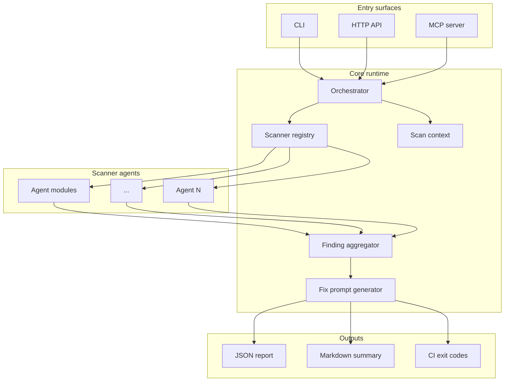

# Among-Check Core — Technical Architecture

**Audience:** Human engineers and **coding agents** implementing Among-Check Core.

**Tagline:** Find imposters among codebase.

This document is the source of truth for **how to build** the system. Product intent lives in [overview.md](./overview.md). When generating code, follow this layout, interfaces, and phase order unless a human explicitly overrides them.

---

## 1. System context

Among-Check Core is a **security scanner orchestration platform**. It does not implement every check in one binary; it runs an **agent swarm** of small, focused scanners behind a shared runtime.



### Non-goals (v1)

- Full DAST replacement or authenticated crawl of large SPAs
- Legal compliance certification (heuristics only)
- Storing customer scan data server-side (local/CI execution first)

---

## 2. Repository layout

Use a **pnpm monorepo** with TypeScript. Agents must not invent alternate top-level layouts.

```
among-check-core/
├── packages/
│   ├── core/                 # Types, orchestrator, registry, report model
│   ├── cli/                  # `among-check` binary
│   ├── mcp/                  # MCP server (stdio + optional HTTP)
│   ├── agents/               # All scanner implementations
│   │   ├── vuln/             # SQLi, XSS, IDOR, CSRF, ...
│   │   ├── config/           # Headers, TLS, cookies, compliance
│   │   ├── infra/            # Vercel, Netlify, Cloudflare, Supabase, Firebase
│   │   ├── supply/           # Secrets, GitHub Actions, dependencies
│   │   └── specialized/      # Tenant isolation, webhooks, browser storage
│   └── shared/               # HTTP, git, parsers, test actors, logging
├── docs/
│   ├── overview.md
│   ├── architecture.md       # this file
│   └── scanner-catalog.md
├── .cursor/
├── .claude/
├── .github/
├── AGENTS.md
├── CLAUDE.md
├── package.json
├── pnpm-workspace.yaml
└── tsconfig.base.json
```

### Package dependency rules

| Package | May depend on |
|---------|----------------|
| `core` | `shared` only |
| `agents/*` | `core`, `shared` |
| `cli`, `mcp` | `core`, `agents` (barrel import), `shared` |
| `shared` | External libs only |

**Never** import `cli` or `mcp` from `core` or `agents`.

---

## 3. Core domain model

All agents emit the same `Finding` shape. The orchestrator normalizes and deduplicates.

### 3.1 Types (`packages/core/src/types.ts`)

```typescript
export type Severity = 'critical' | 'high' | 'medium' | 'low' | 'info';

export type FindingCategory =
  | 'vulnerability'
  | 'configuration'
  | 'infrastructure'
  | 'supply-chain'
  | 'specialized';

export interface ScanTarget {
  url?: string;
  repoPath?: string;
  cloud?: CloudTarget;
}

export interface CloudTarget {
  provider: 'vercel' | 'netlify' | 'cloudflare' | 'supabase' | 'firebase';
  projectId?: string;
  configPath?: string;
}

export interface ScanOptions {
  timeoutMs?: number;          // default 30_000
  parallel?: number;           // default 16
  categories?: FindingCategory[];
  scannerIds?: string[];       // allowlist; default = all registered
  auth?: TestActor[];          // for tenant-isolation and authenticated checks
  outputFormat?: 'json' | 'markdown';
}

export interface TestActor {
  id: string;
  label: string;
  headers?: Record<string, string>;
  cookies?: Record<string, string>;
  bearerToken?: string;
}

export interface Evidence {
  summary: string;
  request?: string;
  response?: string;
  snippet?: string;
  filePath?: string;
  lineRange?: [number, number];
}

export interface Finding {
  id: string;                  // stable slug, e.g. "headers.missing-hsts"
  scannerId: string;
  title: string;
  severity: Severity;
  category: FindingCategory;
  location: string;
  impact: string;
  remediation: string;
  evidence: Evidence;
  aiFixPrompt: string;
  metadata?: Record<string, unknown>;
}

export interface ScanReport {
  scanId: string;
  startedAt: string;
  finishedAt: string;
  durationMs: number;
  target: ScanTarget;
  findings: Finding[];
  stats: {
    total: number;
    bySeverity: Record<Severity, number>;
    scannersRun: number;
    scannersFailed: number;
  };
}
```

### 3.2 Scanner contract (`packages/core/src/scanner.ts`)

Every check is a **Scanner** — pure async function + metadata.

```typescript
export interface ScannerMeta {
  id: string;                  // unique, kebab-case: "vuln.open-redirect"
  name: string;
  category: FindingCategory;
  description: string;
  tags: string[];
  estimatedMs: number;
  requiresAuth?: boolean;
  requiresRepo?: boolean;
  requiresUrl?: boolean;
}

export interface ScannerContext {
  target: ScanTarget;
  options: ScanOptions;
  signal: AbortSignal;
  logger: Logger;
  http: HttpClient;            // from shared
  fs: FileSystemAdapter;
  git?: GitAdapter;
}

export interface Scanner {
  meta: ScannerMeta;
  run(ctx: ScannerContext): Promise<Finding[]>;
}
```

**Rules for scanner implementations:**

1. Return `[]` when not applicable (wrong target type), never throw for "skip".
2. Throw only on unexpected internal errors; orchestrator catches and records `scannersFailed`.
3. `id` must match `scanner-catalog.md` entry when catalog lists it.
4. `aiFixPrompt` is required on every finding — use `buildAiFixPrompt()` from `core`.
5. Keep each scanner **single-purpose**; compose at orchestrator level, not inside one mega-scanner.

### 3.3 Registry (`packages/core/src/registry.ts`)

```typescript
export interface ScannerRegistry {
  register(scanner: Scanner): void;
  list(filter?: { categories?: FindingCategory[]; ids?: string[] }): Scanner[];
  get(id: string): Scanner | undefined;
}
```

Registration happens in `packages/agents/src/index.ts` (barrel). Each subpackage exports its scanners; barrel imports and registers all.

### 3.4 Orchestrator (`packages/core/src/orchestrator.ts`)

Responsibilities:

1. Validate `ScanTarget` and `ScanOptions`
2. Resolve scanner list from registry
3. Run scanners with **bounded concurrency** (`p-limit` or equivalent)
4. Enforce **global timeout** (`options.timeoutMs`, default 30s)
5. Merge findings, **dedupe** by `(id, location)` hash
6. Sort by severity then `id`
7. Build `ScanReport`

```typescript
export async function runScan(
  target: ScanTarget,
  options: ScanOptions,
  registry: ScannerRegistry
): Promise<ScanReport>;
```

---

## 4. Agent swarm execution model

| Concern | Approach |
|---------|----------|
| Parallelism | Pool size `options.parallel` (default 16); independent scanners only |
| Timeout | `AbortSignal` linked to global deadline; partial report on timeout |
| Auth actors | `TestActor[]` injected into context for tenant-isolation agent |
| Rate limiting | `shared/http` per-host throttle to avoid self-DoS |
| Failure isolation | One scanner failure does not abort the scan |

### Severity rubric (agents must follow)

| Severity | When |
|----------|------|
| `critical` | Exploitable without auth, secret exposure, RLS wide open |
| `high` | Exploitable with low friction, missing webhook verification |
| `medium` | Defense-in-depth gaps, misconfig with partial mitigation |
| `low` | Best-practice deviations |
| `info` | Informational fingerprinting |

---

## 5. Notable scanner designs

### 5.1 Tenant isolation (`agents/specialized/tenant-isolation`)

Requires **≥ 2** `TestActor` entries in `ScanOptions.auth`.

Algorithm:

1. Discover resource IDs accessible as Actor A (URLs from sitemap, API enumeration, or config).
2. Replay requests as Actor B using same resource IDs.
3. Flag any `200` with cross-tenant data or mutation success.

Finding `id`: `specialized.tenant-isolation-leak`

### 5.2 Webhook security (`agents/specialized/webhook-signature`)

1. Static: find route handlers matching webhook patterns (`/webhook`, `/hooks/`, provider names).
2. Dynamic (if URL): probe with unsigned POST; flag `2xx` without challenge.

Finding `id`: `specialized.webhook-no-signature`

### 5.3 Browser storage (`agents/specialized/browser-storage`)

1. If URL: load page in headless browser (Playwright).
2. Inspect `localStorage` / `sessionStorage` keys and values for JWT-shaped strings, `api_key`, etc.

Finding `id`: `specialized.sensitive-browser-storage`

---

## 6. Entry surfaces

### 6.1 CLI (`packages/cli`)

```
among-check scan --url https://example.com
among-check scan --repo .
among-check scan --url https://app.example.com --auth actors.json
among-check scan --repo . --category supply-chain
among-check list-scanners
among-check mcp   # optional: start MCP stdio from CLI shim
```

Exit codes: `0` = no critical/high; `1` = findings ≥ high; `2` = runtime error.

### 6.2 MCP server (`packages/mcp`)

Tools to expose:

| Tool | Purpose |
|------|---------|
| `among_check_scan` | Run scan from editor |
| `among_check_list_scanners` | Introspect registry |
| `among_check_explain_finding` | Expand one finding + fix prompt |

Transport: **stdio** default; document HTTP in README when added.

### 6.3 HTTP API (phase 3, optional)

`POST /v1/scan` with JSON body matching `ScanTarget` + `ScanOptions`. Same `runScan()` path.

---

## 7. AI-ready fix prompts

`packages/core/src/fix-prompt.ts`:

```typescript
export function buildAiFixPrompt(finding: Omit<Finding, 'aiFixPrompt'>): string;
```

Template sections (in order):

1. **Role** — "You are fixing a security issue in Among-Check."
2. **Finding** — title, severity, location
3. **Evidence** — trimmed snippet
4. **Impact** — one paragraph
5. **Required fix** — remediation steps
6. **Constraints** — minimal diff, preserve behavior, add tests if package has tests

Agents generating findings **must** use this helper — no hand-rolled one-off prompts.

---

## 8. Shared utilities (`packages/shared`)

| Module | Responsibility |
|--------|----------------|
| `http/` | Fetch wrapper, redirect follower, header capture |
| `git/` | Shallow log, grep secrets patterns |
| `parse/` | package.json, workflow YAML, Supabase/Firebase rules |
| `browser/` | Playwright lifecycle for storage/XSS checks |
| `logger/` | Structured JSON logs, scanner-scoped child loggers |

---

## 9. Testing strategy

| Layer | Location | Expectation |
|-------|----------|-------------|
| Unit | `*.test.ts` next to scanner | Mock `ScannerContext`, assert `Finding[]` |
| Contract | `packages/core` | Registry, dedupe, timeout, severity sort |
| Integration | `packages/agents` | VCR/fixtures against sample apps in `fixtures/` |
| E2E | `packages/cli` | Golden JSON report for `fixtures/vulnerable-app` |

**Fixture apps** live in `fixtures/` (not published):

- `fixtures/vulnerable-app/` — intentional vulns for regression
- `fixtures/clean-app/` — expect zero critical/high

---

## 10. Implementation phases (agents: follow in order)

### Phase 0 — Scaffold

- [ ] pnpm workspace, `tsconfig.base.json`, ESLint, Vitest
- [ ] `core` types + registry + orchestrator (stub scanners)
- [ ] `cli` with `scan` and `list-scanners`
- [ ] Empty `agents` barrel

### Phase 1 — Config & supply (fast wins)

- [ ] Headers scanner (CSP, HSTS, X-Frame-Options, Referrer-Policy)
- [ ] TLS/SSL basic checker
- [ ] Cookie flags analyzer
- [ ] Git secrets patterns (API keys, tokens)
- [ ] GitHub Actions permission analyzer

### Phase 2 — Vulnerability baselines

- [ ] Open redirect, IDOR probes, CSRF heuristics
- [ ] Reflected XSS probes (safe, non-destructive payloads)
- [ ] Dependency CVE lookup (OSV API)

### Phase 3 — Infrastructure

- [ ] Supabase RLS policy parser
- [ ] Firebase rules parser
- [ ] Vercel/Netlify/Cloudflare config auditors

### Phase 4 — Specialized + MCP

- [ ] Tenant isolation, webhook, browser storage
- [ ] MCP server tools
- [ ] Markdown report formatter

---

## 11. Naming conventions

| Artifact | Pattern | Example |
|----------|---------|---------|
| Scanner id | `{category}.{kebab-name}` | `config.missing-hsts` |
| File | `{kebab-name}.scanner.ts` | `missing-hsts.scanner.ts` |
| Test | `{kebab-name}.scanner.test.ts` | |
| Finding id | same as scanner id or `scannerId.variant` | `supply.leaked-aws-key` |

---

## 12. Security & ethics constraints for codegen

Coding agents **must**:

- Use **non-destructive** probe payloads only
- Respect `robots.txt` for crawls (configurable override for owned targets)
- Never exfiltrate scan targets to third parties except OSV/CVE APIs
- Redact secrets in evidence blocks (replace with `***`)
- Not commit real credentials to fixtures

---

## 13. Extension: adding a new scanner

1. Add entry to `docs/scanner-catalog.md`
2. Implement `Scanner` in correct `agents/{category}/` folder
3. Register in `agents/src/index.ts`
4. Add unit test + fixture if applicable
5. Update MCP tool schema descriptions if user-facing

---

## Related documents

- [overview.md](./overview.md) — product capabilities
- [scanner-catalog.md](./scanner-catalog.md) — full check list
- [AGENTS.md](../AGENTS.md) — agent workflow rules
- [CONTRIBUTING.md](../CONTRIBUTING.md) — human + agent contribution
