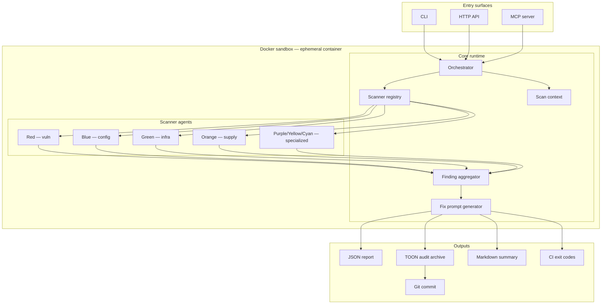

# Among-Check Core — Technical Architecture

**Audience:** Human engineers and **coding agents** implementing Among-Check Core.

**Tagline:** Find imposters among codebase.

This document is the source of truth for **how to build** the system. Product intent lives in [overview.md](./overview.md). When generating code, follow this layout, interfaces, and phase order unless a human explicitly overrides them.

---

## Table of contents

| § | Section |
|---|---------|
| [1](#1-system-context) | System context |
| [2](#2-repository-layout) | Repository layout |
| [3](#3-core-domain-model) | Core domain model |
| [4](#4-agent-swarm-execution-model) | Agent swarm execution model |
| [5](#5-notable-scanner-designs) | Notable scanner designs |
| [6](#6-entry-surfaces) | Entry surfaces — CLI, MCP, HTTP API |
| [7](#7-ai-ready-fix-prompts) | AI-ready fix prompts |
| [8](#8-shared-utilities) | Shared utilities |
| [9](#9-testing-strategy) | Testing strategy |
| [10](#10-implementation-phases) | Implementation phases |
| [11](#11-naming-conventions) | Naming conventions |
| [12](#12-security-and-ethics-constraints) | Security & ethics constraints |
| [13](#13-adding-a-new-scanner) | Extension: adding a new scanner |
| [14](#14-audit-archive) | Audit archive (TOON version control) |
| [15](#15-agent-skills) | Agent skills |
| [16](#16-swarm-runtime) | Swarm runtime (fix-swarm orchestration) |
| [17](#17-docker-sandbox) | Docker sandbox |
| [18](#18-external-skills-catalog) | External skills catalog |
| [19](#19-related-documents) | Related documents |

---

## 1. System context

Among-Check Core is a **security scanner orchestration platform**. It does not implement every check in one binary — it runs an **agent swarm** of small, focused scanners behind a shared runtime. All probe execution happens inside an ephemeral **Docker sandbox** (§17).



### Non-goals (v1)

- Full DAST replacement or authenticated crawl of large SPAs
- Legal compliance certification (heuristics only)
- Storing customer scan data server-side (local/CI execution first)

---

## 2. Repository layout

Use a **pnpm monorepo** with TypeScript. Agents must not invent alternate top-level layouts.

```
among-check-core/
├── packages/
│   ├── core/                 # Types, orchestrator, registry, report model
│   │   └── src/
│   │       ├── types.ts
│   │       ├── scanner.ts
│   │       ├── registry.ts
│   │       ├── orchestrator.ts
│   │       ├── fix-prompt.ts
│   │       ├── audit-archive.ts
│   │       └── runtime.ts        # Swarm runtime types (§16)
│   ├── cli/                  # `among-check` binary
│   ├── mcp/                  # MCP server (stdio + optional HTTP)
│   ├── agents/               # All scanner implementations
│   │   ├── vuln/             # Red — SQLi, XSS, IDOR, CSRF, ...
│   │   ├── config/           # Blue — Headers, TLS, cookies, compliance
│   │   ├── infra/            # Green — Vercel, Netlify, Cloudflare, Supabase, Firebase
│   │   ├── supply/           # Orange — Secrets, GitHub Actions, dependencies
│   │   └── specialized/      # Purple/Yellow/Cyan — Tenant, webhook, browser storage
│   └── shared/               # HTTP, git, parsers, test actors, logging
│       └── src/
│           ├── http/
│           ├── git/
│           ├── parse/
│           ├── browser/
│           ├── logger/
│           └── toon/
├── docker/
│   ├── scanner.Dockerfile    # Ephemeral sandbox image (§17)
│   └── README.md
├── audits/                   # TOON audit archive (committed; see §14)
│   ├── README.md
│   ├── latest.toon
│   ├── index.toon
│   └── history/
│       └── <iso-timestamp>/
│           ├── report.toon
│           ├── findings.toon
│           └── delta.toon
├── markers/                  # Git-backed task tracker (see §16)
│   ├── README.md
│   ├── index.toon
│   ├── open/
│   └── closed/
├── .among-check/             # Hub runtime state — sandboxes, anchors, gate (see §16)
│   ├── README.md
│   └── hub.toon
├── skills/                   # Agent skills + external cybersecurity skills (see §15, §18)
│   ├── README.md
│   ├── registry.toon
│   ├── orchestrator/         # Commander
│   ├── agent-vuln/           # Red
│   ├── agent-config/         # Blue
│   ├── agent-infra/          # Green
│   ├── agent-supply/         # Orange
│   ├── agent-tenant/         # Purple
│   ├── agent-webhook/        # Yellow
│   ├── agent-browser/        # Cyan
│   ├── agent-audit/          # White
│   ├── agent-fix/            # Pink
│   ├── agent-sentinel/       # Silver
│   ├── swarm-runtime/        # Runtime coordination
│   ├── 01-recon-osint/       # ─┐ Masriyan 01–15 (46 files)
│   ├── ...                   #  │
│   ├── 15-blue-team-defense/ # ─┘
│   ├── 16-web-app-security/  # ─┐ Anthropic 16–29 (754 playbooks)
│   │   ├── testing-for-xss-vulnerabilities/
│   │   └── ...               #  │
│   ├── ...                   #  │
│   └── 29-zero-trust-network-access/ # ─┘
├── docs/
│   ├── README.md             # Documentation index
│   ├── overview.md           # Product capabilities
│   ├── architecture.md       # ← this file
│   ├── swarm-runtime.md      # Multi-agent orchestration
│   ├── sandbox.md            # Docker isolation spec (§17)
│   ├── agent-skills.md       # Skill invoke guide
│   ├── audit-archive.md      # TOON schemas & agent workflow
│   └── scanner-catalog.md    # Scanner ID registry
├── fixtures/
│   ├── actors.example.json   # Test actor template
│   ├── vulnerable-app/       # Intentional vulns for regression
│   └── clean-app/            # Expect zero critical/high
├── scripts/
│   └── (future tooling)
├── .cursor/
│   └── rules/                # Cursor agent rules
├── .claude/
│   └── commands/             # Claude Code slash commands
├── .github/
│   ├── workflows/
│   │   ├── ci.yml
│   │   └── audit.yml
│   ├── ISSUE_TEMPLATE/
│   └── pull_request_template.md
├── AGENTS.md
├── CLAUDE.md
├── CONTRIBUTING.md
├── package.json
├── pnpm-workspace.yaml
└── tsconfig.base.json
```

### Package dependency rules

| Package | May depend on |
|---------|---------------|
| `core` | `shared` only |
| `agents/*` | `core`, `shared` |
| `cli`, `mcp` | `core`, `agents` (barrel import), `shared` |
| `shared` | External libs only |

**Never** import `cli` or `mcp` from `core` or `agents`.

---

## 3. Core domain model

All agents emit the same `Finding` shape. The orchestrator normalizes and deduplicates.

### 3.1 Types (`packages/core/src/types.ts`)

```typescript
export type Severity = 'critical' | 'high' | 'medium' | 'low' | 'info';

export type FindingCategory =
  | 'vulnerability'
  | 'configuration'
  | 'infrastructure'
  | 'supply-chain'
  | 'specialized';

export interface ScanTarget {
  url?: string;
  repoPath?: string;
  cloud?: CloudTarget;
}

export interface CloudTarget {
  provider: 'vercel' | 'netlify' | 'cloudflare' | 'supabase' | 'firebase';
  projectId?: string;
  configPath?: string;
}

export interface AuditArchiveOptions {
  enabled?: boolean;           // default true
  commit?: boolean;            // git commit after write; default true
  rootDir?: string;            // default: git root of target repo
  directory?: string;          // default: 'audits'
  writeDelta?: boolean;        // default true — delta.toon vs previous latest
}

export interface ScanOptions {
  timeoutMs?: number;          // default 30_000
  parallel?: number;           // default 16
  categories?: FindingCategory[];
  scannerIds?: string[];       // allowlist; default = all registered
  auth?: TestActor[];          // for tenant-isolation and authenticated checks
  outputFormat?: 'json' | 'markdown' | 'toon';
  archive?: AuditArchiveOptions;
}

export interface TestActor {
  id: string;
  label: string;
  headers?: Record<string, string>;
  cookies?: Record<string, string>;
  bearerToken?: string;
}

export interface Evidence {
  summary: string;
  request?: string;
  response?: string;
  snippet?: string;
  filePath?: string;
  lineRange?: [number, number];
}

export interface Finding {
  id: string;                  // stable slug, e.g. "vuln.sqli"
  scannerId: string;
  title: string;
  severity: Severity;
  category: FindingCategory;
  location: string;
  impact: string;
  remediation: string;
  evidence: Evidence;
  aiFixPrompt: string;
  metadata?: Record<string, unknown>;
}

export interface ScanReport {
  scanId: string;
  startedAt: string;
  finishedAt: string;
  durationMs: number;
  target: ScanTarget;
  findings: Finding[];
  stats: {
    total: number;
    bySeverity: Record<Severity, number>;
    scannersRun: number;
    scannersFailed: number;
  };
}
```

### 3.2 Scanner contract (`packages/core/src/scanner.ts`)

Every check is a **Scanner** — pure async function + metadata.

```typescript
export interface ScannerMeta {
  id: string;                  // unique, kebab-case: "vuln.open-redirect"
  name: string;
  category: FindingCategory;
  description: string;
  tags: string[];
  estimatedMs: number;
  requiresAuth?: boolean;
  requiresRepo?: boolean;
  requiresUrl?: boolean;
}

export interface ScannerContext {
  target: ScanTarget;
  options: ScanOptions;
  signal: AbortSignal;
  logger: Logger;
  http: HttpClient;            // from shared
  fs: FileSystemAdapter;
  git?: GitAdapter;
}

export interface Scanner {
  meta: ScannerMeta;
  run(ctx: ScannerContext): Promise<Finding[]>;
}
```

**Rules for scanner implementations:**

1. Return `[]` when not applicable (wrong target type), never throw for "skip".
2. Throw only on unexpected internal errors; orchestrator catches and records `scannersFailed`.
3. `id` must match `scanner-catalog.md` entry when catalog lists it.
4. `aiFixPrompt` is required on every finding — use `buildAiFixPrompt()` from `core`.
5. Keep each scanner **single-purpose**; compose at orchestrator level, not inside one mega-scanner.

### 3.3 Registry (`packages/core/src/registry.ts`)

```typescript
export interface ScannerRegistry {
  register(scanner: Scanner): void;
  list(filter?: { categories?: FindingCategory[]; ids?: string[] }): Scanner[];
  get(id: string): Scanner | undefined;
}
```

Registration happens in `packages/agents/src/index.ts` (barrel). Each subpackage exports its scanners; barrel imports and registers all.

### 3.4 Orchestrator (`packages/core/src/orchestrator.ts`)

Responsibilities:

1. Validate `ScanTarget` and `ScanOptions`
2. Resolve scanner list from registry
3. Run scanners with **bounded concurrency** (`p-limit` or equivalent)
4. Enforce **global timeout** (`options.timeoutMs`, default 30s)
5. Merge findings, **dedupe** by `(id, location)` hash
6. Sort by severity then `id`
7. Build `ScanReport`
8. Call `archiveScanReport()` (White / §14)

```typescript
export async function runScan(
  target: ScanTarget,
  options: ScanOptions,
  registry: ScannerRegistry
): Promise<ScanReport>;
```

---

## 4. Agent swarm execution model

| Concern | Approach |
|---------|----------|
| Parallelism | Pool size `options.parallel` (default 16); independent scanners only |
| Timeout | `AbortSignal` linked to global deadline; partial report on timeout |
| Auth actors | `TestActor[]` injected into context for tenant-isolation agent |
| Rate limiting | `shared/http` per-host throttle to avoid self-DoS |
| Failure isolation | One scanner failure does not abort the scan |
| Execution safety | All tool/probe execution inside Docker sandbox (§17) |

### 4.1 Agent roster

| Codename | Skill | Scanner package | Focus |
|----------|-------|-----------------|-------|
| Commander | `orchestrator` | `packages/core` | Orchestrator, registry, swarm runtime |
| Silver | `agent-sentinel` | `packages/core` | Pulse/Relay/Patrol watchdogs |
| Red | `agent-vuln` | `packages/agents/vuln` | SQLi, XSS, IDOR, CSRF, CVEs |
| Blue | `agent-config` | `packages/agents/config` | Headers, TLS, cookies, compliance |
| Green | `agent-infra` | `packages/agents/infra` | Cloud, containers, Supabase, Firebase |
| Orange | `agent-supply` | `packages/agents/supply` | Secrets, GitHub Actions, dependencies |
| Purple | `agent-tenant` | `packages/agents/specialized` | Tenant isolation |
| Yellow | `agent-webhook` | `packages/agents/specialized` | Webhook signatures, JWT, API auth |
| Cyan | `agent-browser` | `packages/agents/specialized` | Browser storage |
| White | `agent-audit` | `packages/core` | TOON archive, git commit |
| Pink | `agent-fix` | `packages/core` | AI-ready fix prompts |

### 4.2 Severity rubric (agents must follow)

| Severity | When |
|----------|------|
| `critical` | Exploitable without auth, secret exposure, RLS wide open |
| `high` | Exploitable with low friction, missing webhook verification |
| `medium` | Defense-in-depth gaps, misconfig with partial mitigation |
| `low` | Best-practice deviations |
| `info` | Informational fingerprinting |

---

## 5. Notable scanner designs

### 5.1 Tenant isolation (`agents/specialized/tenant-isolation`)

Requires **≥ 2** `TestActor` entries in `ScanOptions.auth`.

Algorithm:
1. As Actor A — enumerate resource IDs (URLs from sitemap, API enumeration, or config).
2. As Actor B — replay same IDs with B's credentials.
3. Flag any `200` with cross-tenant data or mutation success.

Finding `id`: `specialized.tenant-isolation-leak`

### 5.2 Webhook security (`agents/specialized/webhook-signature`)

1. Static: find route handlers matching webhook patterns (`/webhook`, `/hooks/`, provider names).
2. Dynamic (if URL): probe with unsigned POST; flag `2xx` without challenge.

Finding `id`: `specialized.webhook-no-signature`

### 5.3 Browser storage (`agents/specialized/browser-storage`)

1. Requires `target.url`.
2. Load page in headless Playwright (inside Docker sandbox).
3. Inspect `localStorage` / `sessionStorage` keys and values for JWT-shaped strings, `api_key`, etc.

Finding `id`: `specialized.sensitive-browser-storage`

---

## 6. Entry surfaces

### 6.1 CLI (`packages/cli`)

```bash
among-check scan --url https://example.com
among-check scan --repo .
among-check scan --url https://app.example.com --auth actors.json
among-check scan --repo . --category supply-chain
among-check scan --repo . --format toon          # stdout TOON
among-check scan --repo . --no-audit-commit      # write audits/ without git commit
among-check audit log                            # print index.toon / latest summary
among-check list-scanners
among-check mcp                                  # start MCP stdio from CLI shim

# Swarm runtime (Phase R2)
among-check commander status
among-check sandbox create|list|use
among-check anchor create|resume|list
among-check marker create|list|close|sync-audit
among-check sweep create|assign|status
among-check gate enqueue|status|approve
among-check sentinel status|patrol
```

Exit codes: `0` = no critical/high; `1` = findings ≥ high; `2` = runtime error.

Every scan **writes** `audits/` in the target repo by default (see §14).

### 6.2 MCP server (`packages/mcp`)

| Tool | Purpose |
|------|---------|
| `among_check_scan` | Run scan from editor; archives TOON + commits by default |
| `among_check_list_scanners` | Introspect registry |
| `among_check_explain_finding` | Expand one finding + fix prompt |
| `among_check_read_audit` | Return `latest.toon`, `delta.toon`, and `index.toon` for agent context |
| `among_check_commander_status` | Hub + marker + sweep status (Phase R5) |
| `among_check_marker_list` | Open markers for current sandbox (Phase R5) |

Transport: **stdio** default; document HTTP in README when added.

### 6.3 HTTP API (Phase 3, optional)

`POST /v1/scan` with JSON body matching `ScanTarget` + `ScanOptions`. Same `runScan()` path.

---

## 7. AI-ready fix prompts

`packages/core/src/fix-prompt.ts`:

```typescript
export function buildAiFixPrompt(finding: Omit<Finding, 'aiFixPrompt'>): string;
```

Template sections (in order):

1. **Role** — "You are fixing a security issue in Among-Check."
2. **Finding** — title, severity, location
3. **Evidence** — trimmed snippet
4. **Impact** — one paragraph
5. **Required fix** — remediation steps
6. **Constraints** — minimal diff, preserve behavior, add tests if package has tests

Agents generating findings **must** use this helper — no hand-rolled one-off prompts.

---

## 8. Shared utilities (`packages/shared`)

| Module | Responsibility |
|--------|----------------|
| `http/` | Fetch wrapper, redirect follower, header capture |
| `git/` | Shallow log, grep secrets patterns, worktree adapter (§16) |
| `parse/` | package.json, workflow YAML, Supabase/Firebase rules |
| `browser/` | Playwright lifecycle for storage/XSS checks |
| `logger/` | Structured JSON logs, scanner-scoped child loggers |
| `toon/` | `encodeReport`, `decodeReport`, strict validation via `@toon-format/toon` |

### 8.1 Git adapter extensions (`packages/shared/git/`)

Required for swarm runtime anchors (§16):

```typescript
createWorktree(repoPath: string, branch: string, path: string): Promise<void>
removeWorktree(path: string): Promise<void>
listWorktrees(repoPath: string): Promise<WorktreeEntry[]>
commitAuditArchive(message: string): Promise<string>  // returns sha
```

---

## 9. Testing strategy

| Layer | Location | Expectation |
|-------|----------|-------------|
| Unit | `*.test.ts` next to scanner | Mock `ScannerContext`, assert `Finding[]` |
| Contract | `packages/core` | Registry, dedupe, timeout, severity sort |
| Integration | `packages/agents` | VCR/fixtures against sample apps in `fixtures/` |
| E2E | `packages/cli` | Golden JSON report for `fixtures/vulnerable-app` |
| Sandbox | `docker/` | `docker build` + smoke scan against `fixtures/vulnerable-app` |

**Fixture apps** live in `fixtures/` (not published):

- `fixtures/vulnerable-app/` — intentional vulns for regression
- `fixtures/clean-app/` — expect zero critical/high
- `fixtures/actors.example.json` — test actor template for Purple agent

---

## 10. Implementation phases

Follow **Phase 0 → R5** in order. Do not skip scaffold to add feature scanners early.

### Phase 0 — Scaffold

- [ ] pnpm workspace, `tsconfig.base.json`, ESLint, Vitest
- [ ] `core` types + registry + orchestrator (stub scanners)
- [ ] `cli` with `scan`, `list-scanners`, and `audit log`
- [ ] Empty `agents` barrel
- [ ] `core` audit archiver stub + TOON encode/decode round-trip tests
- [ ] `audits/` layout + placeholder `latest.toon` / `index.toon`
- [ ] `docker/scanner.Dockerfile` build passes

### Phase 1 — Config & supply (fast wins)

- [ ] Headers scanner (CSP, HSTS, X-Frame-Options, Referrer-Policy)
- [ ] TLS/SSL basic checker
- [ ] Cookie flags analyzer
- [ ] Git secrets patterns (API keys, tokens)
- [ ] GitHub Actions permission analyzer

### Phase 2 — Vulnerability baselines

- [ ] Open redirect, IDOR probes, CSRF heuristics
- [ ] Reflected XSS probes (safe, non-destructive payloads)
- [ ] Dependency CVE lookup (OSV API)

### Phase 3 — Infrastructure

- [ ] Supabase RLS policy parser
- [ ] Firebase rules parser
- [ ] Vercel/Netlify/Cloudflare config auditors

### Phase 4 — Specialized + MCP

- [ ] Tenant isolation, webhook, browser storage
- [ ] MCP server tools (include `among_check_read_audit`)
- [ ] Markdown report formatter
- [ ] Audit archiver: delta computation + git auto-commit

### Phase R0 — Swarm runtime docs & scaffold ✅

- [x] `docs/swarm-runtime.md`
- [x] `markers/` scaffold
- [x] `.among-check/hub.toon`
- [x] Silver + swarm-runtime skills

### Phase R1 — Runtime types

- [ ] `packages/core/src/runtime.ts` — `Marker`, `Sweep`, `Anchor`, `GateJob`

### Phase R2 — Runtime CLI

- [ ] `sandbox`, `anchor`, `marker`, `sweep`, `gate`, `sentinel` commands

### Phase R3 — Git worktree adapter

- [ ] `createWorktree`, `removeWorktree`, `listWorktrees` in `packages/shared/git/`

### Phase R4 — Sentinel daemon

- [ ] Pulse heartbeat writer in scout sessions
- [ ] Relay: stale anchor detection + re-queue
- [ ] Patrol: abandoned worktree cleanup

### Phase R5 — MCP runtime tools

- [ ] `among_check_commander_status`, `among_check_marker_list`

---

## 11. Naming conventions

| Artifact | Pattern | Example |
|----------|---------|---------|
| Scanner id | `{category}.{kebab-name}` | `config.missing-hsts` |
| File | `{kebab-name}.scanner.ts` | `missing-hsts.scanner.ts` |
| Test file | `{kebab-name}.scanner.test.ts` | |
| Finding id | same as scanner id or `scannerId.variant` | `supply.leaked-aws-key` |
| Skill folder | `{agent-name}/` or `{kebab-skill-name}/` | `agent-vuln/`, `testing-for-xss-vulnerabilities/` |
| Marker id | `marker-{YYYYMMDD}-{seq}` | `marker-20260610-001` |
| Anchor id | `anchor-{codename}-{seq}` | `anchor-red-01` |
| Sweep id | `sweep-{YYYYMMDD}-{letter}` | `sweep-20260610-a` |

---

## 12. Security and ethics constraints

Coding agents **must**:

- Use **non-destructive** probe payloads only — no `DROP TABLE`, no destructive mutations
- Run all tool/probe execution **inside the Docker sandbox** (§17) — never on bare host
- Respect `robots.txt` for crawls (configurable override for owned targets)
- Never exfiltrate scan targets to third parties except OSV/CVE APIs
- Redact secrets in evidence blocks — replace matched values with `***`
- Not commit real credentials to fixtures
- Use synthetic `TestActor` entries for Purple agent — never real production tokens
- Confirm target authorization before running active probes

---

## 13. Adding a new scanner

1. Identify owning agent from `skills/registry.toon`
2. Read that agent's `skills/<agent>/SKILL.md` — check External skills table for relevant upstream playbooks
3. Add entry to `docs/scanner-catalog.md`
4. Implement `Scanner` in correct `agents/{category}/` folder
5. Register in `agents/src/index.ts`
6. Add unit test + fixture if applicable
7. Update MCP tool schema descriptions if user-facing

---

## 14. Audit archive (TOON version control)

Every scan run is **persisted to git** so coding agents retain security context across sessions. Full spec: [audit-archive.md](./audit-archive.md).

### 14.1 Pipeline (`packages/core/src/audit-archive.ts`)

Runs **after** `runScan()` succeeds (partial reports allowed on timeout — still archive with `metadata.partial: true`).

```typescript
export interface AuditArchiveResult {
  directory: string;           // absolute path to audits/
  files: string[];             // written paths
  committed: boolean;
  commitSha?: string;
  delta?: AuditDelta;
}

export interface AuditDelta {
  previousScanId?: string;
  currentScanId: string;
  newFindings: Pick<Finding, 'id' | 'severity' | 'location'>[];
  resolvedFindings: Pick<Finding, 'id' | 'location'>[];
  unchangedCount: number;
}

export async function archiveScanReport(
  report: ScanReport,
  options: AuditArchiveOptions,
  deps: { toon: ToonCodec; git: GitAdapter; fs: FileSystemAdapter }
): Promise<AuditArchiveResult>;
```

Steps:

1. Resolve git root from `target.repoPath` or `process.cwd()`
2. Redact secrets in report (see [audit-archive.md](./audit-archive.md))
3. Encode full report → `history/<iso>/report.toon`
4. Emit tabular `findings.toon` (uniform array — optimal TOON shape)
5. Load previous `latest.toon`, compute `delta.toon`, write to history
6. Overwrite `latest.toon` and prepend run to `index.toon`
7. If `commit: true` and inside git repo: `git add audits/` + commit:

   `chore(security): among-check audit <iso> (<n> findings)`

**Never** commit if `commit: false`, not a git repo, or `CI` env with `AMONG_CHECK_AUDIT_COMMIT=false`.

### 14.2 TOON codec (`packages/shared/toon/`)

- Dependency: `@toon-format/toon`
- `encodeReport(report: ScanReport): string` — canonical field order for stable diffs
- `decodeReport(toon: string): ScanReport` — `strict: true`
- `encodeFindingsTable(findings: Finding[]): string` — tabular subset for agents
- `encodeDelta(delta: AuditDelta): string`

Agents reading TOON should prefer `findings.toon` and `delta.toon` over full `report.toon` unless they need `aiFixPrompt` text.

### 14.3 Orchestrator integration

```typescript
const report = await runScan(target, options, registry);
if (options.archive?.enabled !== false) {
  await archiveScanReport(report, options.archive ?? {}, deps);
}
return report;
```

CLI, MCP, and CI **all** call this path — no duplicate archive logic in entry surfaces.

### 14.4 Agent contract

Coding agents working in a repo scanned by Among-Check **must**:

1. Read `audits/latest.toon` at session start when touching security-sensitive code
2. After fixes, expect a new audit commit; verify `resolved[]` in latest `delta.toon`
3. Treat `new[]` in `delta.toon` as regressions to fix before merge

---

## 15. Agent skills

Each swarm member has an individual identity in `skills/<agent>/SKILL.md`. Invoke the owning skill before implementing that agent's scanners. Machine roster: `skills/registry.toon`.

| Codename | Skill ID | Package | Role |
|----------|----------|---------|------|
| Commander | `orchestrator` | `packages/core` | Attach point; scan + fix swarm |
| Silver | `agent-sentinel` | `packages/core` | Watchdogs (Pulse/Relay/Patrol) |
| Red | `agent-vuln` | `packages/agents/vuln` | SQLi, XSS, IDOR, CSRF, CVEs |
| Blue | `agent-config` | `packages/agents/config` | Headers, TLS, cookies, compliance |
| Green | `agent-infra` | `packages/agents/infra` | Cloud, containers, BaaS |
| Orange | `agent-supply` | `packages/agents/supply` | Secrets, GitHub Actions |
| Purple | `agent-tenant` | `packages/agents/specialized` | Tenant isolation |
| Yellow | `agent-webhook` | `packages/agents/specialized` | Webhook, JWT, API auth |
| Cyan | `agent-browser` | `packages/agents/specialized` | Browser storage |
| White | `agent-audit` | `packages/core` | TOON archive, git commit |
| Pink | `agent-fix` | `packages/core` | AI-ready fix prompts |

All skills live in `skills/` — no `.cursor/skills/` mirror. See [agent-skills.md](./agent-skills.md).

---

## 16. Swarm runtime (fix-swarm orchestration)

Long-running multi-agent work uses a **runtime layer** separate from the 30s scan pipeline. Full spec: [swarm-runtime.md](./swarm-runtime.md).

```
Hub (.among-check/)
 └── Sandbox (one git repo)
      ├── Anchors    — git worktrees + state.toon (scout persistence)
      ├── Markers    — git-backed atomic tasks
      ├── Sweeps     — batched marker assignments per scout
      └── Gate       — test + re-scan → merge queue
```

### 16.1 Types (`packages/core/src/runtime.ts`)

```typescript
export type MarkerStatus = 'open' | 'in_progress' | 'closed' | 'cancelled';
export type AnchorStatus = 'idle' | 'in_progress' | 'stale' | 'closed';
export type GateStatus   = 'pending' | 'running' | 'passed' | 'failed' | 'merged';

export interface Marker {
  markerId: string;
  title: string;
  status: MarkerStatus;
  priority: 'critical' | 'high' | 'medium' | 'low';
  assignee: string;           // scout codename
  source: 'audit' | 'manual' | 'scanner-request';
  sandboxId: string;
  findingId?: string;
  findingLocation?: string;
  acceptance: string[];
  aiFixPrompt?: string;
  createdAt: string;
}

export interface AnchorState {
  anchorId: string;
  agent: string;
  sandboxId: string;
  branch: string;
  worktreePath: string;
  markerIds: string[];
  status: AnchorStatus;
  lastHeartbeat: string;
  checkpoint?: { summary: string; files: string[] };
}

export interface Sweep {
  sweepId: string;
  sandboxId: string;
  assignee: string;
  anchorId: string;
  markerIds: string[];
  status: 'assigned' | 'in_progress' | 'complete' | 'cancelled';
  createdAt: string;
  deadline?: string;
}

export interface GateJob {
  gateId: string;
  sweepId: string;
  anchorId: string;
  branch: string;
  status: GateStatus;
  checks: { name: string; status: 'pending' | 'passed' | 'failed' }[];
}
```

### 16.2 Commander attach (entry point)

All human and editor sessions start through Commander:

1. Read `.among-check/hub.toon` — active sandbox and defaults
2. Read `markers/index.toon` — open work queue
3. Read `audits/latest.toon` — current security state
4. Sync Markers from `delta.new` findings that lack a Marker
5. Assign Sweeps → scouts; create/resume Anchors
6. On completion → Gate (test + re-scan) → merge

### 16.3 Best practices

| Practice | Implementation |
|----------|----------------|
| Single entry point | Commander attach — `/commander` or `swarm-runtime` skill |
| Repo isolation | One Sandbox per Git repo |
| Persistent state | Anchors (worktrees) + `state.toon` |
| Git-backed tasks | `markers/` TOON files committed |
| Safe merge | Gate queue (test + re-scan) |
| Stuck-agent recovery | Silver sentinels (Pulse/Relay/Patrol) |
| Safe tool execution | Docker sandbox (§17) |
| Parallel stability | tmux for multi-scout sessions |

---

## 17. Docker sandbox

All scan agents that invoke tools or probes run inside an **ephemeral Docker container**. Never run probe tooling on bare host. Full spec: [sandbox.md](./sandbox.md).

### 17.1 Image (`docker/scanner.Dockerfile`)

- Base: `node:20-slim`
- Includes: Playwright Chromium, git, curl, python3
- Non-root user: `scanner` (uid 1001)
- No inbound ports exposed

### 17.2 Security constraints

| Flag | Enforcement |
|------|-------------|
| `--rm` | Container destroyed on exit |
| `--read-only` | Host filesystem immutable inside container |
| `--tmpfs /tmp` | Ephemeral scratch only |
| `--cap-drop ALL` | No Linux capabilities |
| `--security-opt no-new-privileges` | No privilege escalation |
| `-v repo:ro` | Source repo mounted read-only (Orange agent) |

### 17.3 Quick start

```bash
# Build
docker build -f docker/scanner.Dockerfile -t among-check-scanner .

# Scan URL
docker run --rm --read-only --tmpfs /tmp:rw,size=256m \
  --cap-drop ALL --security-opt no-new-privileges \
  -v "$(pwd)/audits:/scan/audits:rw" \
  among-check-scanner scan --url https://example.com

# Scan repo
docker run --rm --read-only --tmpfs /tmp:rw,size=512m \
  --cap-drop ALL --security-opt no-new-privileges \
  -v "$(pwd):/repo:ro" -v "$(pwd)/audits:/scan/audits:rw" \
  among-check-scanner scan --repo /repo
```

### 17.4 Per-agent sandbox notes

| Scout | Extra constraint |
|-------|-----------------|
| Red | `--network host` to reach target URL |
| Green | Never inject real cloud credentials — read-only config mount |
| Orange | Repo mounted `:ro`; `AMONG_CHECK_AUDIT_COMMIT=false` inside container |
| Purple | Synthetic `TestActor` creds via env — never real tokens |
| Yellow | Benign probe payloads only |
| Cyan | Playwright Chromium headless; may need `--ipc=host` |

### 17.5 CI integration

See [sandbox.md](./sandbox.md) for GitHub Actions workflow example.

---

## 18. External skills catalog

977 practitioner cybersecurity playbooks live in `skills/` alongside Among-Check agent skills (989 total). No external repo dependency — all content is vendored. Skills are classified into **numbered category folders** (`01-` → `30-`) so agents can navigate by domain without scanning a flat 977-entry list.

### 18.1 Sources

| Source | Skills | License | Category folders |
|--------|--------|---------|-----------------|
| [Claude-Code-CyberSecurity-Skill](https://github.com/Masriyan/Claude-Code-CyberSecurity-Skill) by [@Masriyan](https://github.com/Masriyan) | 46 topic files | MIT | `skills/01-` … `skills/15-` |
| [Anthropic Cybersecurity Skills](https://github.com/mukul975/Anthropic-Cybersecurity-Skills) by [@mukul975](https://github.com/mukul975) | 754 playbooks | Apache 2.0 | `skills/16-` … `skills/29-` |
| [awesome-ai-security](https://github.com/ottosulin/awesome-ai-security) by [@ottosulin](https://github.com/ottosulin) | 177 tools/frameworks | MIT | `skills/30-ai-security/` |

### 18.2 Category structure

```
skills/
├── 01-recon-osint/                    (Masriyan) 01–15
├── 02-vulnerability-scanner/
│   └── ...
├── 15-blue-team-defense/
├── 16-web-app-security/               (Anthropic) 16–29
│   ├── testing-for-xss-vulnerabilities/
│   ├── exploiting-sql-injection-vulnerabilities/
│   └── ... (100 playbooks)
├── 17-network-security/               (45)
├── 18-digital-forensics/              (45)
├── 19-malware-analysis/               (68)
├── 20-cloud-security/                 (92)
├── 21-identity-access-management/     (66)
├── 22-threat-intelligence-osint/      (96)
├── 23-incident-response/              (81)
├── 24-penetration-testing-red-team/   (29)
├── 25-vulnerability-management/       (33)
├── 26-ics-iot-ot-security/            (31)
├── 27-devsecops-supply-chain/         (25)
├── 28-cryptography-pki/               (22)
├── 29-zero-trust-network-access/      (21)
└── 30-ai-security/                    (177 — LLM/AI security tools, frameworks, models)
    ├── learning-resources/
    ├── governance-risk/
    ├── attack-red-teaming/
    ├── benchmarks-evals/
    ├── defense-controls/
    ├── agentic-skills/
    ├── security-ai-models/
    └── datasets/
```

### 18.3 Agent → category mapping

Each agent's `SKILL.md` `## External skills` section points to the relevant numbered categories (deduplicated — no category appears in more than one agent's primary list).

| Scout | Primary category folders |
|-------|-------------------------|
| Red | 16 (web app), 17 (network), 19 (malware), 22 (threat intel), 24 (pentest) |
| Blue | 17 (network), 25 (vuln mgmt), 28 (crypto/PKI) |
| Green | 20 (cloud), 26 (ICS/OT), 29 (zero trust) |
| Orange | 27 (DevSecOps) |
| Purple | 21 (IAM) |
| Yellow | 16 (web app), 21 (IAM), 28 (crypto) |
| Cyan | 16 (browser/storage) |
| White | 18 (forensics), 23 (IR) |
| Commander | 22 (threat intel), 23 (IR), 24 (red team) |

### 18.4 Usage

External skills are **reference-only** when invoked in an editor session. When executing tool commands, run inside the Docker sandbox (§17).

```
# Load a playbook
skills/16-web-app-security/testing-for-xss-vulnerabilities/SKILL.md

# Browse a category
skills/22-threat-intelligence-osint/

# Full skills index
skills/README.md
```

---

## 19. Related documents

| Document | Purpose |
|----------|---------|
| [overview.md](./overview.md) | Product capabilities |
| [swarm-runtime.md](./swarm-runtime.md) | Fix-swarm orchestration |
| [sandbox.md](./sandbox.md) | Docker isolation spec |
| [agent-skills.md](./agent-skills.md) | Agent identity roster |
| [audit-archive.md](./audit-archive.md) | TOON schemas, CI, redaction |
| [scanner-catalog.md](./scanner-catalog.md) | Full check list |
| [skills/README.md](../skills/README.md) | Skill index |
| [AGENTS.md](../AGENTS.md) | Agent workflow rules |
| [CONTRIBUTING.md](../CONTRIBUTING.md) | Human + agent contribution |
