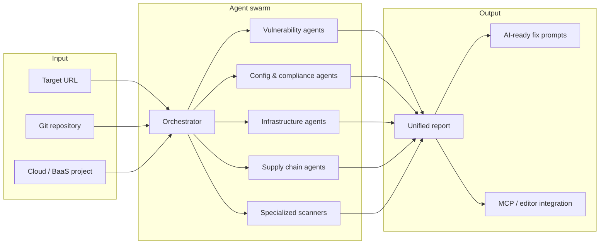

# Among-Check — Product Overview

**Tagline:** Find imposters among codebase.

Among-Check is a security platform powered by an **agent swarm**: specialized agents that run in parallel to execute **100+ individual security checks** against your application, infrastructure, and supply chain. The swarm is designed for **rapid integration** — target a URL, repo, or cloud project and receive a **full report in under 30 seconds**.

Think of it as an automated security engineer that identifies misconfigurations and vulnerabilities, then hands you **direct, actionable fixes** instead of a wall of CVE IDs.

---

## Design goals

1. **Speed** — Parallel agent execution; full surface-area report in &lt; 30 seconds.
2. **Coverage** — Web app flaws, cloud/BaaS config, headers/TLS, compliance signals, and CI/CD supply chain in one pass.
3. **Actionability** — Every finding includes context, severity, and an **AI-ready fix prompt** you can paste into your editor or agent.
4. **Editor-native** — MCP (Model Context Protocol) server so scans run from Cursor, Claude Code, and compatible tools without leaving the workflow.

---

## Agent swarm architecture

Among-Check does not rely on a single monolithic scanner. Work is split across **focused agents**, each responsible for a slice of the security surface. Agents coordinate through a shared orchestration layer that:

- Dispatches checks in parallel where safe
- Deduplicates and correlates findings (e.g. missing header + cookie misconfig on the same route)
- Normalizes severity and produces a single structured report
- Attaches **AI-ready fix prompts** per finding

### Agent categories

| Category | Role |
|----------|------|
| **Vulnerability agents** | Dynamic and static checks for injection, XSS, IDOR, CSRF, redirects, access control, dependency CVEs |
| **Configuration & compliance agents** | Headers, TLS, cookies/sessions, privacy/legal surface checks |
| **Infrastructure & cloud agents** | Hosting platforms (Vercel, Netlify, Cloudflare) and BaaS (Supabase RLS, Firebase rules) |
| **Supply chain agents** | Secret leakage, GitHub Actions hygiene, dependency and pipeline risk |
| **Specialized scanners** | Tenant isolation, webhooks, browser storage, and other high-impact vertical checks |

---

## Key capabilities

### Vulnerability scanning

Detects critical application flaws and stack-level exposure:

- **SQL injection** — Unsafe query construction and parameter handling
- **Cross-site scripting (XSS)** — Reflected, stored, and DOM-based vectors
- **IDOR** — Insecure direct object references; unauthorized access to resources by ID manipulation
- **CSRF** — Missing or weak anti-CSRF controls on state-changing operations
- **Open redirects** — User-controlled redirect targets usable for phishing or token theft
- **Broken access control** — Missing authorization on routes, APIs, and admin surfaces
- **Known CVEs** — Dependency and runtime fingerprinting against published vulnerabilities

### Configuration & compliance

Audits how the app presents itself on the wire and to regulators/users:

- **Security headers** — CSP, HSTS, `X-Frame-Options`, `Referrer-Policy`, etc.
- **SSL/TLS** — Certificate validity, protocol/cipher posture, mixed content
- **Cookie & session security** — `Secure`, `HttpOnly`, `SameSite`, session fixation risks
- **Legal & privacy (basic)** — Signals for GDPR-relevant artifacts, Terms of Service presence, and common privacy-page gaps (not legal advice; automated heuristics only)

### Infrastructure & cloud

Platform-aware scanners for where modern apps actually run:

| Platform | Focus |
|----------|--------|
| **Vercel** | Deployment exposure, env handling, edge/config misconfigurations |
| **Netlify** | Build/deploy settings, redirect and header rules |
| **Cloudflare** | DNS, proxy, WAF, and SSL modes |
| **Supabase** | Row Level Security (RLS) policies, exposed tables, anon/service role usage |
| **Firebase** | Security rules, public collections, auth boundary gaps |

### Supply chain & secrets

Repository- and pipeline-oriented checks:

- **Leaked secrets** — API keys, tokens, private keys in history and working tree
- **GitHub Actions** — Over-permissive workflows, unpinned actions, secret exfiltration patterns
- **Supply chain config** — Dependency pinning, install scripts, and risky CI permissions

### AI-native integration

Among-Check is built for teams that fix issues with AI-assisted development:

- **AI-ready fix prompt** — Each finding includes a self-contained prompt: what failed, why it matters, suggested remediation, and relevant file/route context when available.
- **MCP server** — Model Context Protocol integration so compatible editors (e.g. **Cursor**, **Claude Code**) can trigger scans, stream results, and apply fixes in-repo without custom glue code.

---

## Notable scanners

These checks address failures that are easy to miss in manual review but high impact in production.

### Tenant isolation

Uses **two authenticated test actors** (synthetic users or configured test accounts) to verify:

- User A cannot read or mutate User B’s data via API or UI paths
- IDs, slugs, and tokens do not become cross-tenant keys
- Admin or support endpoints do not bypass tenant boundaries

**Imposter signal:** Data or actions that belong to one tenant visible or executable under another session.

### Webhook security

Identifies webhook **handlers that process incoming events without verifying signatures** (or with weak verification):

- Missing HMAC / provider signature headers
- Replay-friendly endpoints without timestamp or idempotency checks
- Debug routes that accept arbitrary POST bodies as webhooks

**Imposter signal:** An endpoint that *looks* like a secured integration but accepts unauthenticated payloads.

### Browser storage

Audits sensitive material stored in **`localStorage`** or **`sessionStorage`**:

- JWTs and refresh tokens
- API keys or PII cached client-side
- Session identifiers readable by any script on the origin (XSS amplification)

**Imposter signal:** Credentials dressed as “session convenience” but exposed to any XSS on the page.

---

## Report model

A typical Among-Check report includes:

| Field | Description |
|-------|-------------|
| **Finding ID** | Stable identifier for tracking and deduplication |
| **Severity** | Critical / High / Medium / Low / Informational |
| **Category** | Vulnerability, config, infrastructure, supply chain, specialized |
| **Location** | URL, route, file path, cloud resource, or workflow name |
| **Evidence** | Request/response snippet, config excerpt, or policy diff |
| **Impact** | Plain-language risk summary |
| **Remediation** | Concrete fix steps |
| **AI-ready fix prompt** | Copy-paste prompt for your editor or coding agent |

Reports are structured (e.g. JSON) for CI gates and human-readable summaries for review.

### TOON audit archive (version control)

Every scan is **committed to git** under `audits/` using **[TOON](https://toonformat.dev/)** — a compact, agent-friendly format (~40% fewer tokens than JSON for finding lists). Coding agents read `audits/latest.toon` and `delta.toon` to see current issues, fixes, and regressions without re-scanning.

See [audit-archive.md](./audit-archive.md).

---

## Integration surfaces (planned)

- **CLI** — Scan from terminal; exit codes for CI
- **HTTP API** — Programmatic scans for platforms and internal tools
- **MCP server** — Native scanning from AI-enabled editors
- **GitHub / GitLab** — PR comments and check runs on changed paths

Exact commands and configuration will be documented as each surface ships.

---

## Philosophy: finding imposters

In Among-Check, an **imposter** is anything that *claims* to be secure but isn’t:

- A route that looks authenticated but isn’t
- A webhook that pretends to be verified
- A cookie that looks like a session but lacks protections
- A Supabase table with RLS “enabled” but policies that allow `true`
- A repo that looks clean but still has a key in git history

The swarm’s job is to **find those imposters among your codebase and config** — fast, comprehensively, and with fixes you can act on immediately.

---

## Roadmap (documentation vs implementation)

This document describes the **intended** Among-Check Core system. Implementation of individual agents, the orchestrator, MCP server, and CLI/API is in progress. As components land, companion docs will cover:

- Scanner catalog (full list of 100+ checks)
- MCP setup and editor configuration
- CI/CD integration examples
- False-positive tuning and custom policies

---

## Related reading

- [README](../README.md) — Project entry point and quick capability summary
- [architecture.md](./architecture.md) — Technical design for implementation and codegen
- [audit-archive.md](./audit-archive.md) — TOON audit history in git
- [scanner-catalog.md](./scanner-catalog.md) — Scanner ID registry
- [AGENTS.md](../AGENTS.md) — Coding agent instructions
