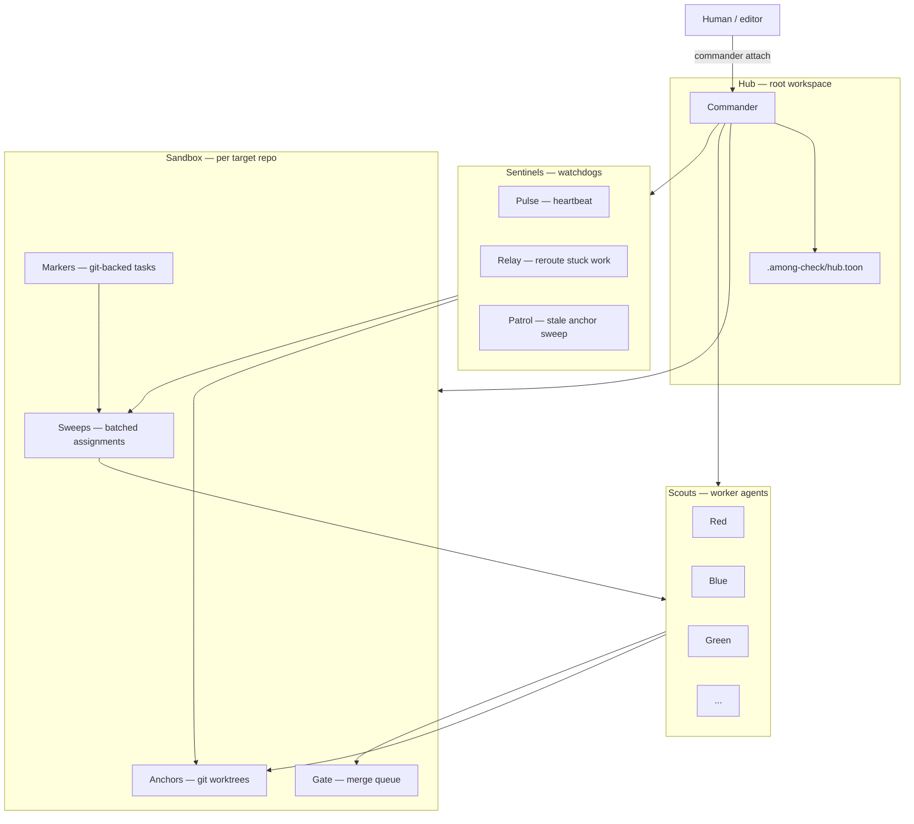
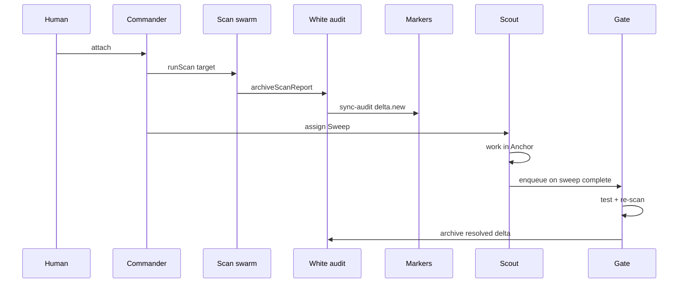

# Swarm Runtime — Multi-Agent Orchestration

**Tagline:** Find imposters among codebase.

Among-Check runs two layers of agents:

1. **Scan swarm** — Commander dispatches Red, Blue, Green, … to probe a target in &lt; 30s.
2. **Fix swarm** — Commander coordinates coding agents that remediate findings without losing context across restarts.

This document defines the **runtime layer** for layer 2 and for long-running development on Among-Check Core itself. It encodes proven multi-agent orchestration patterns using **Among-Check-native names** (no third-party product terminology).

---

## Design goals

| Goal | Mechanism |
|------|-----------|
| No lost context on agent crash | **Anchors** — persistent git worktrees per worker |
| Single source of truth for work | **Markers** — git-backed task files |
| Isolated projects | **Sandboxes** — one target repo per container |
| Safe merges | **Gate** — verify-then-merge queue |
| Stuck worker recovery | **Sentinels** — background liveness monitors |
| Human simplicity | **Commander attach** — one entry point for all work |

---

## Component map



### Terminology

| Term | Role | Gas-Town-like pattern (not used here) |
|------|------|--------------------------------------|
| **Hub** | Root workspace where Commander runs; holds `.among-check/` | Town |
| **Sandbox** | Isolated wrapper around one Git repository under scan/fix | Rig |
| **Scout** | Worker agent (Red, Blue, …) executing markers | Worker agent |
| **Anchor** | Git worktree storing a scout's branch + `state.toon` | Persistent worktree |
| **Marker** | Atomic git-backed task (finding fix, scanner impl, chore) | Issue bead |
| **Sweep** | Bundle of markers assigned to one scout in one session | Task convoy |
| **Gate** | Merge queue: lint, test, re-scan, then merge to target branch | Refinery |
| **Sentinel** | Background monitor subsystem (Pulse, Relay, Patrol) | Watchdog |
| **Commander** | Primary coordinator — all human and editor sessions start here | Mayor |

---

## Hub

The **Hub** is the directory where you run Among-Check orchestration commands. For Among-Check Core development, the Hub is this repository root.

```
<hub>/
├── .among-check/
│   ├── hub.toon              # Hub identity + defaults
│   └── sandboxes/
│       └── <sandboxId>/
│           ├── sandbox.toon
│           ├── anchors/
│           ├── markers/
│           ├── sweeps/
│           └── gate/
├── markers/                  # Hub-local markers (Among-Check Core tasks)
└── audits/                   # Security audit archive (scan output)
```

`hub.toon` fields:

```toon
hubId: among-check-core
createdAt: 2025-06-08T00:00:00Z
defaults:
  parallel: 16
  timeoutMs: 30000
  sentinelEnabled: true
  gateRequired: true
  tmuxRecommended: true
sandboxes[1]{id,repoPath,branch,status}:
  self,.,main,active
```

---

## Sandboxes

**Rule:** One codebase = one Sandbox. Never mix unrelated repositories in the same Sandbox.

A Sandbox wraps a target `repoPath` (absolute or relative to Hub). Scans, markers, anchors, and gate merges are scoped to that repo.

```toon
sandboxId: ac-core
repoPath: .
defaultBranch: main
createdAt: 2025-06-08T00:00:00Z
status: active
anchors[2]{id,agent,worktreePath,branch,lastHeartbeat}:
  anchor-red-01,Red,.among-check/sandboxes/ac-core/anchors/red-01,fix/supply-secrets,2025-06-08T12:00:00Z
  anchor-blue-01,Blue,.among-check/sandboxes/ac-core/anchors/blue-01,fix/config-hsts,2025-06-08T12:05:00Z
```

### CLI (planned)

```bash
among-check sandbox create --repo /path/to/app --id my-app
among-check sandbox list
among-check sandbox use my-app          # set active sandbox for session
```

---

## Anchors

An **Anchor** is a **git worktree** bound to one scout. It survives editor restarts and agent crashes.

### Why worktrees

- Each scout works on an isolated branch without clobbering others
- `state.toon` in the anchor records progress, files touched, marker IDs
- Commander can reattach: `among-check anchor resume --id anchor-red-01`

### Anchor layout

```
.among-check/sandboxes/<id>/anchors/<anchorId>/
├── state.toon          # scout memory checkpoint
├── SESSION.md          # human-readable log (optional)
└── (git worktree → actual checkout at repoPath)
```

`state.toon` example:

```toon
anchorId: anchor-red-01
agent: Red
sandboxId: ac-core
branch: fix/supply-secrets
markerIds[1]: marker-20250608-001
status: in_progress
lastHeartbeat: 2025-06-08T12:30:00Z
checkpoint:
  summary: Patched leaked key pattern in git history scan fixture
  files[2]: packages/agents/supply/leaked-secrets.scanner.ts,packages/agents/supply/leaked-secrets.scanner.test.ts
```

### CLI (planned)

```bash
among-check anchor create --agent Red --sandbox ac-core
among-check anchor resume --id anchor-red-01
among-check anchor list --sandbox ac-core
```

---

## Markers

**Markers** are the git-backed issue system. Every unit of work — fix a finding, implement a scanner, docs chore — is a Marker file committed to the repo.

Prefer Markers over chat-only task lists so scouts always read the latest requirements from git.

### Layout (per sandbox / hub)

```
markers/
├── README.md
├── index.toon              # manifest, newest first
├── open/
│   └── marker-20250608-001.toon
└── closed/
    └── marker-20250607-003.toon
```

### Marker schema

```toon
markerId: marker-20250608-001
title: Fix supply.leaked-aws-key in fixtures
status: open
priority: high
assignee: Orange
source: audit
findingId: supply.leaked-aws-key
findingLocation: fixtures/vulnerable-app/.env.example
sandboxId: ac-core
createdAt: 2025-06-08T10:00:00Z
acceptance:
  - Finding absent in audits/latest.toon after re-scan
  - Unit test covers redaction pattern
aiFixPrompt: |
  (copied from finding or Pink)
```

### Creating markers from audits

After a scan, Commander (or `among-check marker sync-audit`) opens Markers for each `new[]` entry in `audits/.../delta.toon` that lacks a matching open Marker.

### CLI (planned)

```bash
among-check marker create --title "..." --assignee Orange
among-check marker sync-audit                  # open markers from delta.new
among-check marker list --status open
among-check marker close marker-20250608-001
```

---

## Sweeps

A **Sweep** bundles multiple Markers for one scout session. Commander assigns a Sweep; the scout works through markers in priority order without re-negotiating scope.

```toon
sweepId: sweep-20250608-a
sandboxId: ac-core
assignee: Orange
anchorId: anchor-orange-01
status: assigned
markerIds[3]: marker-20250608-001,marker-20250608-002,marker-20250608-003
createdAt: 2025-06-08T11:00:00Z
deadline: 2025-06-08T18:00:00Z
```

### Rules

1. One active Sweep per scout per sandbox (avoid context thrash)
2. Commander creates Sweeps; scouts do not self-assign across sandboxes
3. Closing all markers in a Sweep triggers Gate enqueue (if `gateRequired: true`)

---

## Gate

The **Gate** is a verify-then-merge queue. No scout merges directly to `main` when Gate is enabled.

### Pipeline per enqueue

1. Run `pnpm test` (or sandbox-specific test command)
2. Run `among-check scan --repo <sandbox>` — archive TOON
3. Verify sweep markers' `acceptance` criteria (e.g. findings resolved in `delta.resolved`)
4. If pass: merge anchor branch → `defaultBranch` (squash or merge per hub policy)
5. Write `gate/history/<iso>/result.toon`; close markers

```toon
gateId: gate-20250608-001
sweepId: sweep-20250608-a
anchorId: anchor-orange-01
branch: fix/supply-secrets
status: pending
checks[3]{name,status}:
  unit-tests,passed
  security-scan,passed
  marker-acceptance,passed
```

### CLI (planned)

```bash
among-check gate enqueue --sweep sweep-20250608-a
among-check gate status
among-check gate approve gate-20250608-001   # human override
```

---

## Sentinels

**Silver** (agent-sentinel) owns background monitoring. Three internal roles:

| Role | Responsibility |
|------|----------------|
| **Pulse** | Heartbeat — scouts write `lastHeartbeat` to `state.toon` every N minutes |
| **Relay** | If heartbeat stale &gt; threshold, mark anchor `stale`, clone state to new anchor, re-queue Sweep |
| **Patrol** | Periodic scan of open anchors; prune abandoned worktrees after grace period |

### Thresholds (hub defaults)

```toon
sentinel:
  heartbeatIntervalMs: 300000
  staleThresholdMs: 900000
  patrolIntervalMs: 3600000
  abandonedGraceMs: 86400000
```

### CLI (planned)

```bash
among-check sentinel status
among-check sentinel patrol --dry-run
```

Run Sentinels in the background when using tmux (see below).

---

## Commander attach — primary entry point

**Best practice:** Start every session through Commander. Do not micromanage individual scouts from scratch.

### Editor workflow

1. Invoke Commander skill (`orchestrator`) or slash command `/commander`
2. Commander reads `hub.toon`, active sandbox, `markers/index.toon`, `audits/latest.toon`
3. Commander proposes Sweeps or creates Markers from audit delta
4. Commander spawns/resumes Anchors and delegates to scouts
5. On completion, Commander enqueues Gate

### Claude Code

```
/commander Fix open high-priority markers in ac-core sandbox
```

### Cursor

Open Composer with rule `swarm-runtime` active; first message: "Act as Commander — read hub state and list open markers."

---

## tmux recommendation

The runtime spawns parallel processes (scouts, sentinels, gate checks). **Use tmux** (or an equivalent terminal multiplexer) for stable long sessions.

Suggested layout:

```
┌─────────────────────────────────────┐
│ pane 0: Commander (attach)          │
├──────────────────┬──────────────────┤
│ pane 1: Scout    │ pane 2: Scout    │
│ (Red anchor)     │ (Blue anchor)    │
├──────────────────┴──────────────────┤
│ pane 3: Silver sentinel patrol      │
└─────────────────────────────────────┘
```

Document in your shell profile or team wiki; Among-Check does not manage tmux panes automatically in v1.

---

## Integration with scan swarm



---

## Agent responsibilities

| Codename | Runtime role |
|----------|----------------|
| **Commander** | Hub attach, sandbox selection, sweep assignment, gate enqueue |
| **Red–Cyan** | Execute markers in assigned anchor |
| **White** | TOON audit archive; feeds marker sync |
| **Pink** | aiFixPrompt on markers sourced from findings |
| **Silver** | Pulse/Relay/Patrol sentinels |

---

## Implementation phases

| Phase | Deliverable |
|-------|-------------|
| **R0** (now) | Docs, `markers/`, `.among-check/`, skills, AGENTS rules |
| **R1** | `packages/core` types: `Marker`, `Sweep`, `Anchor`, `GateJob` |
| **R2** | CLI: `sandbox`, `anchor`, `marker`, `sweep`, `gate` commands |
| **R3** | Git worktree adapter in `packages/shared/git/` |
| **R4** | Sentinel daemon + heartbeat writer in scout sessions |
| **R5** | MCP tools: `among_check_commander_status`, `among_check_marker_list` |

---

## Related reading

- [architecture.md](./architecture.md) §16 — technical interfaces
- [audit-archive.md](./audit-archive.md) — scan persistence
- [agent-skills.md](./agent-skills.md) — roster
- [skills/swarm-runtime/SKILL.md](../skills/swarm-runtime/SKILL.md) — Commander runtime skill
- [skills/agent-sentinel/SKILL.md](../skills/agent-sentinel/SKILL.md) — Silver sentinel skill
